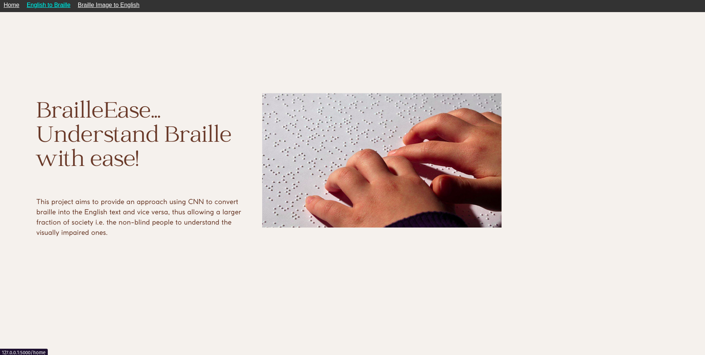
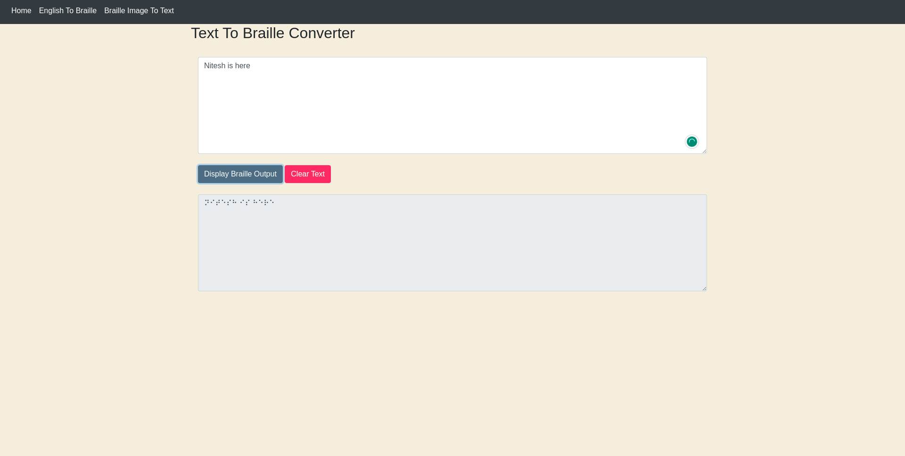
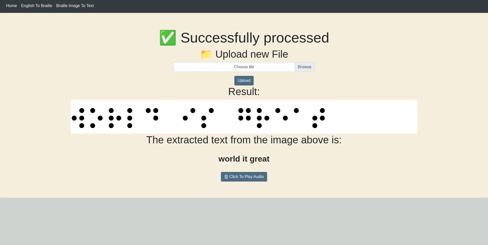

# BrailleEase



BrailleEase is an open-source project that utilizes Convolutional Neural Networks (CNN), Python, and Flask to provide a comprehensive solution for converting English text to Braille code and Braille images to English text. This repository contains the code and resources for the BrailleEase software, enabling seamless conversion between English and Braille for enhanced accessibility and inclusivity.

## Key Features

- English-to-Braille Conversion: BrailleEase accurately converts English text into corresponding Braille code, allowing individuals with visual impairments to access information and written materials.
- Braille-Image-to-English Conversion: BrailleEase utilizes CNN based model and employs computer vision techniques to recognize and interpret Braille characters from images, providing an efficient way to convert Braille images into readable English text.
- Flask Web Application: The BrailleEase repository includes a Flask-based web application that offers a user-friendly interface for interacting with the English-to-Braille and Braille-Image-to-English conversion functionalities.
- Accessibility and Inclusivity: BrailleEase aims to promote accessibility and inclusivity by enabling the conversion of written materials between English and Braille, catering to the diverse needs of users with visual impairments.

`The Dataset of 14k labeled images is used to train the CNN Model`

## Installation

To install and set up BrailleEase, follow these steps:

1. Clone the BrailleEase repository to your local machine.
   ```
   git clone https://github.com/BrailleEase/BrailleEase.git
   ```

2. Install the required dependencies by running the following command:
   ```
   pip install -r requirements.txt
   ```

3. Download any additional resources, such as pre-trained model weights or image datasets, as specified in the repository's documentation.

4. Configure the Flask application by updating the necessary settings, such as API keys or file paths, as instructed in the repository's documentation.

5. Start the Flask server to launch the BrailleEase web application:
   ```
   flask run
   ```

6. Access the BrailleEase application by opening a web browser and navigating to the provided URL.

## Usage

Once you have installed and launched BrailleEase, follow these steps to utilize the English-to-Braille and Braille-to-English conversion functionalities:

1. Open the BrailleEase web application in your web browser.


2. For English-to-Braille conversion:
   - Enter the desired English text in the provided input field.
   - Click the "Display Braille Output" button to obtain the corresponding Braille code.

   

3. For Braille-Image-to-English conversion:
   - Upload an image containing Braille characters using the provided file upload feature.
   - Click the "upload" button to extract and display the corresponding English text.

   

4. Explore additional options and functionalities available within the BrailleEase web application to customize the conversion process or handle specific requirements.

## Contributing

We welcome contributions from the community to enhance BrailleEase. If you are interested in contributing, please follow these steps:

1. Fork the BrailleEase repository.
2. Create a new branch for your feature or bug fix.
3. Make your modifications and commit your changes.
4. Push your branch to your forked repository.
5. Open a pull request in the main BrailleEase repository.


## License

BrailleEase is released under the [MIT License](LICENSE).


## Acknowledgments

We extend our gratitude to the contributors and supporters of the BrailleEase project. Your contributions and feedback play a vital role in improving accessibility and empowering individuals with visual impairments.